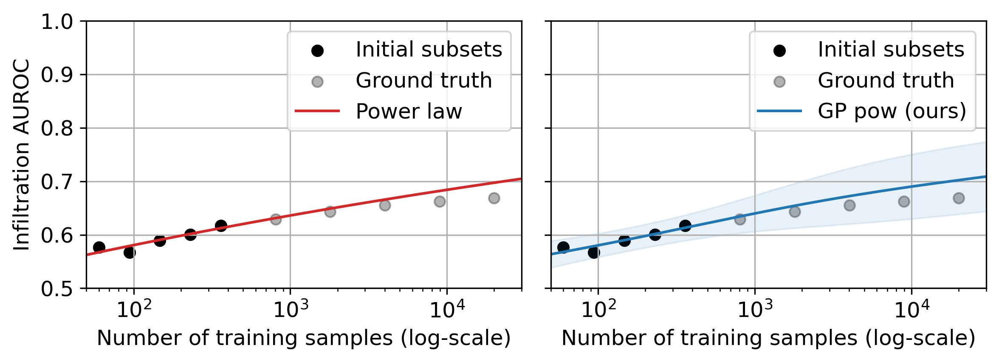

# extrapolating-classifier-accuracy-to-larger-datasets

[A Probabilistic Method to Predict Classifier Accuracy on Larger Datasets given Small Pilot Data](https://github.com/tufts-ml/extrapolating-classifier-accuracy-to-larger-datasets) by Ethan Harvey, Wansu Chen, David M. Kent, and Michael C. Hughes


Figure 1: Example learning curves for predicting infiltration from chest x-rays assessed using area under the receiver operating characteristic (AUROC). Left: Single "best-fit" using power law (Rosenfeld et al., 2020). Right: Our probabilistic Gaussian process with a power law mean function and 95% confidence interval for uncertainty.

## Problem Statement

When a large dataset of labeled images is not available, research projects often have a common trajectory:

(1) gather a small "pilot" dataset of images and corresponding class labels,

(2) train classifiers using this available data, and then

(3) plan to collect an even larger dataset to further improve performance

When gathering more labeled data is expensive, practitioners face a key decision in step 3: *given that the classifier’s accuracy is y% at the current size x, how much better might the model do at 2x, 10x, or 50x images?*

## Our Contributions

Our contributions are:

(1) a reusable GP-based accuracy probabilistic extrapolator (APEx-GP) that can match existing curve-fitting approaches in terms of error while providing additional uncertainty estimates, and 

(2) a careful assessment of our proposed probabilistic extrapolations compared to ground truth on larger datasets across six medical classification tasks involving both 2D and 3D images across diverse modalities (x-ray, ultrasound, and CT) with various sample sizes.

## Using Our Method

To use our Gaussian process to extrapolate classifier accuracy to larger datasets see `notebooks/demo.ipynb`.

##### Initializing our Gaussian process

```python
likelihood = gpytorch.likelihoods.GaussianLikelihood()
# Note: If you want to use the Gaussian process with an arctan mean function use models.GPArctan() instead.
model = models.GPPowerLaw(X_train, y_train, likelihood, epsilon_min=0.05, with_priors=True)
```

##### Extrapolating Classifier Accuracy

```python
with torch.no_grad(): predictions = likelihood(model(X_test))
loc = predictions.mean.numpy()
scale = predictions.stddev.numpy()
# Note: If you want to forecast with 20%-80% change lower and upper percentile.
lower, upper = priors.truncated_normal_uncertainty(a=0.0, b=1.0, loc=loc, scale=scale, lower_percentile=0.025, upper_percentile=0.975) 
```

## Citation

```bibtex
@inproceedings{harvey2023probabilistic,
  author={Harvey, Ethan and Chen, Wansu and Kent, David M. and Hughes, Michael C.},
  title={A Probabilistic Method to Predict Classifier Accuracy on Larger Datasets given Small Pilot Data},
  booktitle={Machine Learning for Health},
  year={2023}
}
```

## Reproducing Results

To reproduce model performance at varying dataset sizes 1) download datasets (see `encode_images/README.md` and `label_images/README.md` for more details) and 2) fit classifiers to each dataset (see `src/finetune_2D.py` and `src/finetune_3D.py`). The results from our paper are saved in `experiments/`.

To reproduce learning curves with the results from our paper see `notebooks/figures.ipynb` and `notebooks/tables.ipynb`.
